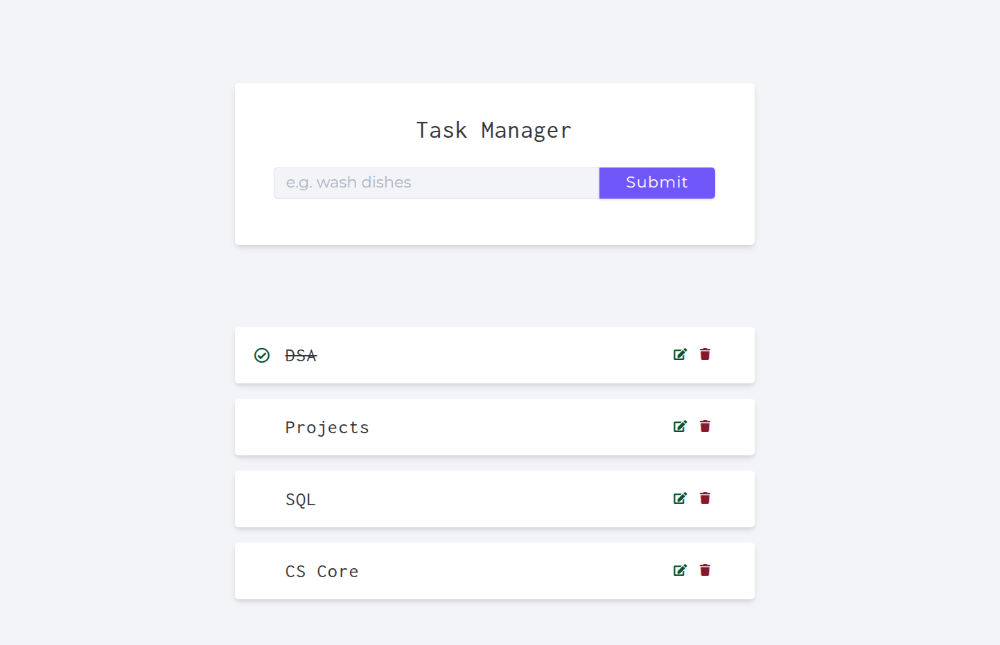
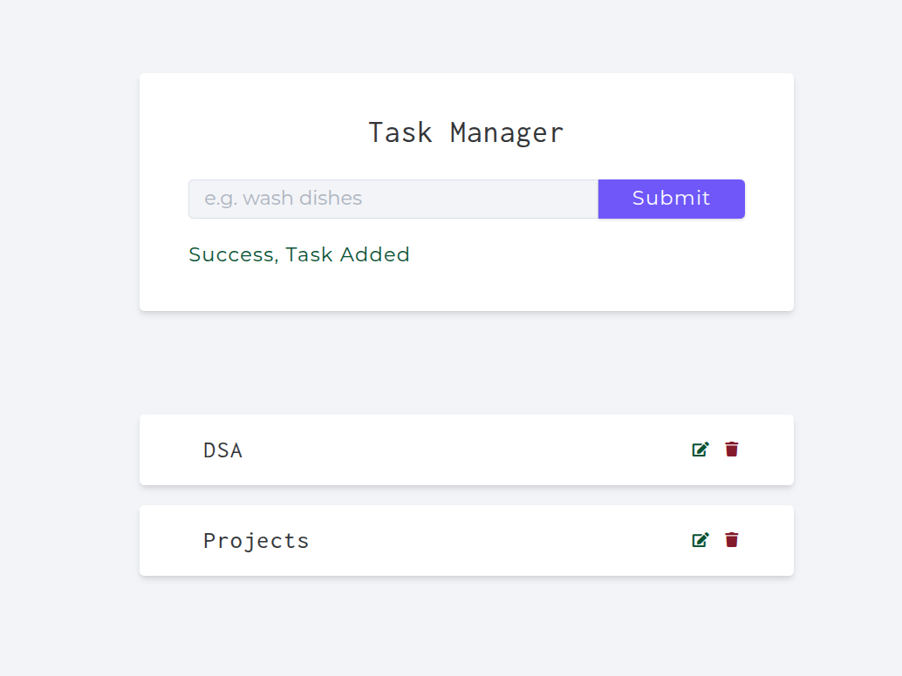
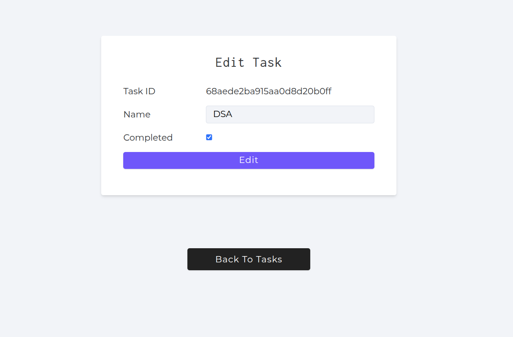

# 📝 Task Manager App

A simple **Task Manager application** built with **Node.js** and **Express.js**.  
It allows users to **add, update, and delete tasks**, with data stored securely in **MongoDB Atlas (Cloud)**.  
The application is **deployed on AWS Elastic Beanstalk** for free hosting and scalability.

---

## 🚀 Features

- ➕ Add new tasks
- ✏️ Update existing tasks
- ❌ Delete tasks
- 📦 Data stored in **MongoDB Cloud**
- ☁️ Deployed using **AWS Elastic Beanstalk**

---

## 🛠️ Tech Stack

- **Backend:** Node.js, Express.js  
- **Database:** MongoDB Atlas (Cloud)  
- **Deployment:** AWS Elastic Beanstalk  

---

## ⚙️ Installation & Setup

1. Clone the repository:
   ```bash
   git clone https://github.com/vrajkmrpatel/task_manager.git
   cd task-manager
   ```

2. Install dependencies:
   ```bash
   npm install
   ```

3. Create a `.env` file in the root directory and add:
   ```env
   PORT=3000
   MONGO_URI=your_mongodb_connection_string
   ```

4. Run the app locally:
   ```bash
   npm start
   ```

5. Visit the app in browser:
   ```
   http://localhost:3000
   ```
---

## 📸 Screenshots

### 🏠 Home Page


### ➕ Add Task


### ✏️ Update Task



---

## 📜 License

This project is licensed under the **MIT License** – feel free to use and modify it.

---

## 👨‍💻 Author

Developed with ❤️ by **[Vrajkumar Patel](https://github.com/vrajkmrpatel)** 🚀  
